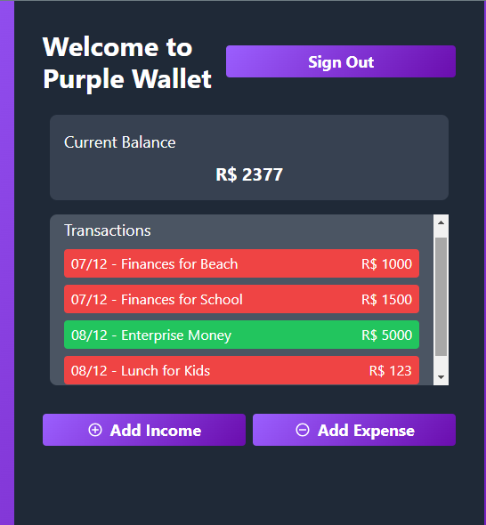
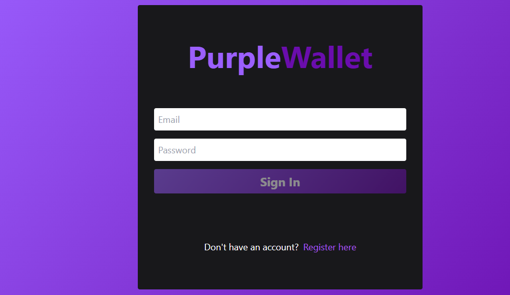
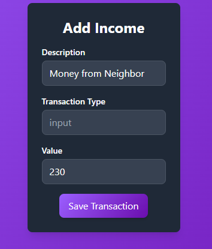

# Purple Wallet - Digital Incomes and Outcomes

Purple Wallet is a modern web application designed for managing personal finances. It allows users to sign up, sign in, add transactions (income/expenses), view transaction history, and track their balance.
## 🚀 Features
* User Authentication: Sign up and sign in with authentication handling.
* Transactions: Add transactions of type income or expense.
* Balance Tracking: Automatically calculate the balance based on transaction history.
* Transaction List: View the list of transactions with date, description, and amount.
* Responsive UI: A beautiful, responsive UI powered by TailwindCSS.
* State Management: Handle application states efficiently with React's built-in hooks.

📦 Tech Stack
* Frontend: React, React Router DOM
* State Management: React Hooks
* Styling: TailwindCSS
* Routing: React Router v6
* API Integration: Axios
* Cookies for Auth Tokens: js-cookie
* Date Manipulation: dayjs
* API Development: Express, Cors
* Token Provider: JSONWebToken

## 🚀 **Authentication Endpoints**
| **Endpoint**     | **Method** | **Description**                         | **Request Body**                                                                                              | **Response**                                                                                                  |
|------------------|------------|-----------------------------------------|----------------------------------------------------------------------------------------------------------------|----------------------------------------------------------------------------------------------------------------|
| `/signup`        | `POST`     | Registers a new user.                  | `{ "email": "string", "password": "string", "fullName": "string" }`                                             | **Success:** `200 OK` `{ "message": "User signed up successfully" }` **Error:** `400 Bad Request` `{ "error": "User already exists" }` |
| `/signin`        | `POST`     | Logs in a user with credentials.       | `{ "email": "string", "password": "string" }`                                                                   | **Success:** `200 OK` `{ "token": "string" }` **Error:** `401 Unauthorized` `{ "error": "Invalid credentials" }`                       |
| `/me`            | `GET`      | Gets authenticated user information.   | **Headers:** `Authorization: Bearer <token>`                                                                    | **Success:** `200 OK` `{ "email": "string", "fullName": "string" }` **Error:** `401 Unauthorized` `{ "error": "Unauthorized access" }` |

---

## 💸 **Transaction Endpoints**

| **Endpoint**         | **Method** | **Description**                            | **Request Body**                                                                                                    | **Response**                                                                                                  |
|----------------------|------------|--------------------------------------------|----------------------------------------------------------------------------------------------------------------------|----------------------------------------------------------------------------------------------------------------|
| `/transactions`       | `POST`     | Creates a new transaction (Income/Expense).| `{ "description": "string", "type": "input" | "output", "value": number }`                                            | **Success:** `201 Created` `{ "id": "string", "description": "string", "type": "input", "value": number, "created_at": "2023-12-08T14:23:45" }` **Error:** `400 Bad Request` `{ "error": "Invalid transaction type" }` |
| `/transactions`       | `GET`      | Retrieves all transactions for the user.  | **Headers:** `Authorization: Bearer <token>`                                                                        | **Success:** `200 OK` `[{ "id": "string", "description": "string", "type": "input", "value": number, "created_at": "2023-12-08T14:23:45" }, {...}]` **Error:** `500 Internal Server Error` `{ "error": "Could not fetch transactions" }` |

---

## 📊 Screenshots

## 💬 Contributions
Contributions are always welcome! Open an issue or submit a PR if you’d like to help improve this application.

## 📜 License
This project is licensed under the <a href="https://opensource.org/license/mit" target="_blank">MIT License.</a>